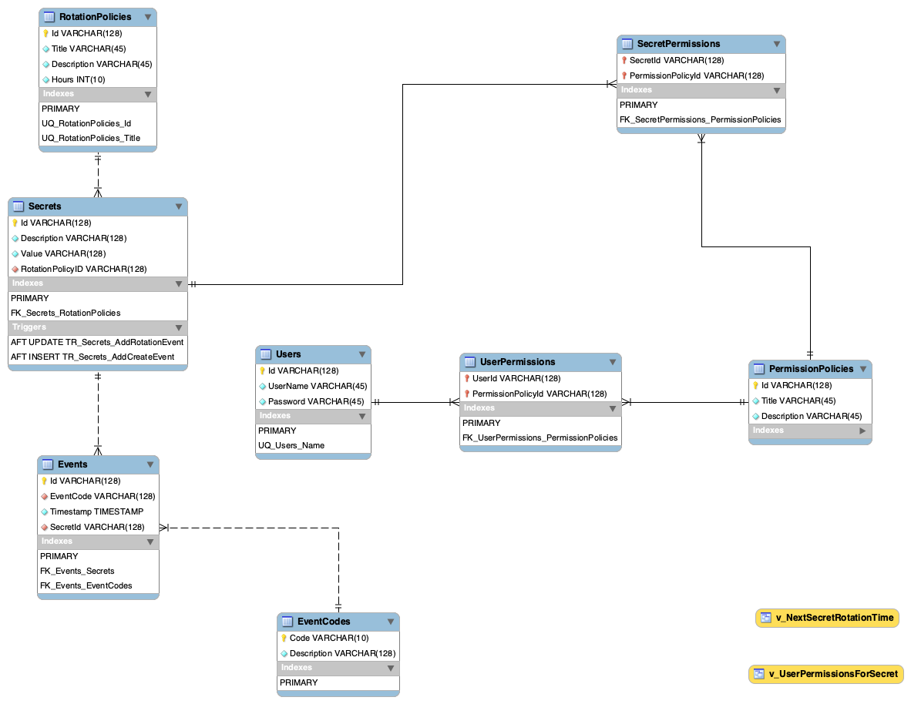

# CSGY6803 Final Project
>**Note**: The code & project in this repository is for educational purposes only. It is NOT production ready and is NOT representative of a "production ready" application. This application and code base is not secure and does not necessarily follow recommended security & development best practices.

## Project Description
The application that will be built as part of the final project is an auditable Password Vault, complete with Role Based Access Control (RBAC) and logging of password change and retrieval events. Users will be created and granted permissions which are then associated to various secrets. Secrets are also rotated (changed) on a regular basis based on the values set in the Rotation Policy. Stored Procedures are used to log the retrieval events, and triggers are used to ensure that the proper metadata is created upon secret creation.

The application will be hosted in Python with a Flask Web server backend, connected to a MariaDB database. Users will access the application using either CURL (for command line access) or through a Swagger Interface (for Web Browser interactive access).

## ER Diagram

## Architecture
